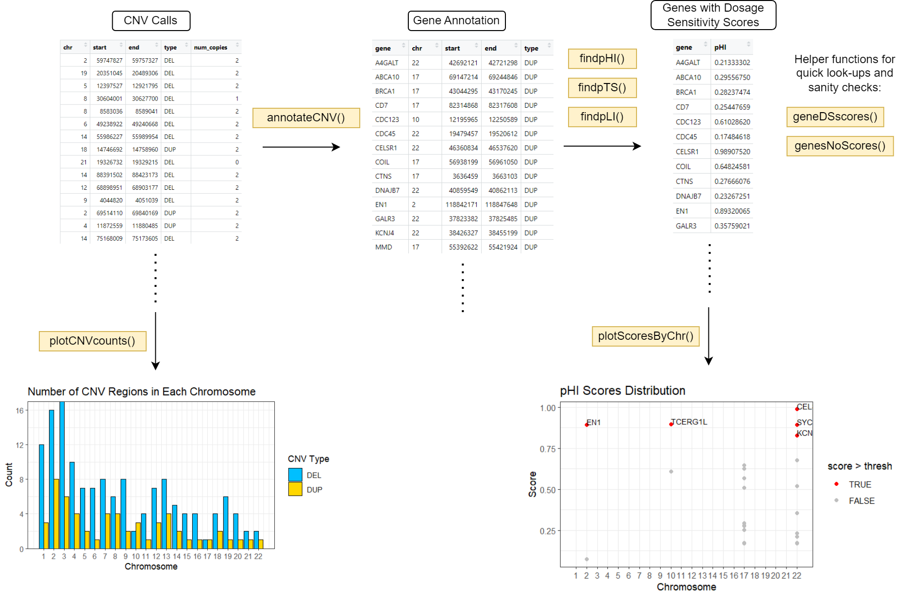

<!-- README.md is generated from README.Rmd. Please edit that file -->

# CNVds

<!-- badges: start -->
<!-- badges: end -->

## Description

`CNVds` is an R package developed to evaluate the pathogenicities of
human CNVs based on the dosage sensitivity scores of the genes that are
encompassed within. Dosage sensitivity (DS) refers to the phenotypic
changes a gene may produce due to changes in its copy numbers. This
package focuses on the following three score metrics:

- Probability of loss intolerance (pLI): the probability that a gene is
  intolerant to a loss of function mutation.
- Probability of haploinsufficiency (pHI): the probability that a gene
  is copy number loss.
- Probability of triplosensitivity (pTS): the probability that the gene
  is sensitive to copy number gain.

The reference DS scores are based on recent publications of genome-wide
dosage sensitivity mappings. Compared to solely measuring the physical
attributes of the CNVs (e.g. size, number of genes, or known association
with disease), DS scores provide additional metrics that are useful in
the systematic identification of pathogenic CNVs. The `CNVds` package
was developed using `R version 4.2.1 (2022-06-23 ucrt)`,
`Platform: x86_64-windows-10_x64`, and running under:
`version build 19044`.

## Installation

You can install the development version of CNVds from
[GitHub](https://github.com/) with:

``` r
# install.packages("devtools")
devtools::install_github("jenydu/CNVds")
```

To run the shinyApp: Under construction

## Overview

``` r
ls("package:CNVds")
data(package = "CNVds") 
browseVignettes("CNVds")
```

`CNVds` currently contains 8 functions:

- `annotateCNV()`: Given a CNV call, return all genes that are fully
  contained in this region based on the GRCh37 or GRCh38 reference
  genome (specified by user).
- `findpLI()`: Given a list of genes, find the corresponding pLI scores
  for each gene.
- `findpHI()`: Given a list of genes, find the corresponding pHI scores
  for each gene.
- `findpTS()`: Given a list of genes, find the corresponding pTS scores
  for each gene.
- `geneDSscores()`: Given a single gene symbol, find its associated pLI,
  pHI, and pTS scores.
- `geneNoScores()`: Given a list of genes and the name of the DS score
  (pLI/pHI/pTS), return the list of genes that don’t have a score in the
  corresponding reference table, and print out the percentage of genes
  without a score. (Note: it is recommended that you run this function
  before finding the dosage sensitivity scores, for sanity check
  purposes.)
- `plotCNVcounts()`: Given a list of CNV calls, plot the total number of
  unique duplication and deletion CNV regions in each chromosome.
- `plotScoresByChr()`: Given a list of genes and their corresponding DS
  scores (pLI/pHI/pTS), plot the distribution of the scores and label
  genes that are especially dosage-sensitive (i.e. above a certain
  user-defined threshold).



## Contributions

The author of the package is Jun Ni Du. The approach to dosage
sensitivity score calculation is based on Alexander-Bloch, A. et
al. (2022)’s publication, with no direct codes taken. The reference
tables are obtained from the following publications and/or packages:

- `grch37.rda` and `grch38.rda` are obtained from the `annotables`
  package. The source files are published by Ensembl (Cunningham, F. et
  al. (2022)).
- `pHaplo_pTriplo_data.rda` is obtained from Collins, R. L. et
  al. (2022).
- `pLI_data.rda` is obtained from Karczewski, K. J. et al. (2020).
- `sampleInputCNV.rda` is obtained from Ming, C, Wang, M, Wang, Q, et
  al. (2022), and a subset of 200 rows is randomly sampled for package
  demonstration purposes.

The *plotScoresByChr* and *plotCNVcounts* functions uses the ggplot
function from the `ggplot2` R package. The *plotScoresByChr* also uses
the drop_na function from the `tidyr` R package, and the setNames
function from the `stats` R package.

## References

Alexander-Bloch, A. et al. (2022). Copy number variant risk scores
associated with cognition, psychopathology, and brain structure in
youths in the philadelphia neurodevelopmental cohort. *JAMA Psychiatry*
79, 699–709. <https://doi.org/10.1001/jamapsychiatry.2022.1017>

Collins, R. L. et al. (2022). A cross-disorder dosage sensitivity map of
the human genome. *Cell* 185, 3041-3055.e25.
<https://doi.org/10.1016/j.cell.2022.06.036>

Cunningham, F. et al. (2022). Ensembl 2022. *Nucleic Acids Research*
50(1), D988-D995. <https://doi.org/10.1093/nar/gkab1049>

Jgraph. (2022). Drawio-desktop. Image created by Du, J. Retrieved
November 14, 2022, from <https://app.diagrams.net/>

Karczewski, K. J. et al. (2020). The mutational constraint spectrum
quantified from variation in 141,456 humans. *Nature* 581, 434–443.
<https://doi.org/10.1038/s41586-020-2308-7>

Ming, C, Wang, M, Wang, Q, et al. (2022). Whole genome sequencing–based
copy number variations reveal novel pathways and targets in Alzheimer’s
disease. *Alzheimer’s & Dementia* 18, 1846-1867.
<https://doi.org/10.1002/alz.12507>

R Core Team (2013). R: A language and environment for statistical
computing. R Foundation for Statistical Computing, Vienna, Austria. ISBN
3-900051-07-0. <http://www.R-project.org/>

Silva, A. (2022). Anjalisilva/TestingPackage: A Simple R Package
Illustrating Components of an R Package: 2019-2022 BCB410H - Applied
Bioinformatics, University of Toronto, Canada. GitHub.
<https://github.com/anjalisilva/TestingPackage>

Turner, S. (2022). Stephenturner/annotables: R data package for
annotating/converting Gene IDs. Github.
<https://github.com/stephenturner/annotables>

Wickham, H. (2016). ggplot2: Elegant Graphics for Data Analysis.
Springer-Verlag New York. ISBN 978-3-319-24277-4.
<https://ggplot2.tidyverse.org>

Wickham, H, Girlich, M. (2022). tidyr: Tidy Messy Data.
<https://tidyr.tidyverse.org>

## Acknowledgements

This package was developed as part of an assessment for 2022 BCB410H:
Applied Bioinformatics course at the University of Toronto, Toronto,
CANADA. `CNVds` welcomes issues, enhancement requests, and other
contributions. To submit an issue, use the [GitHub
issues](https://github.com/jenydu/CNVds/issues). Many thanks to those
who provided feedback to improve this package.
